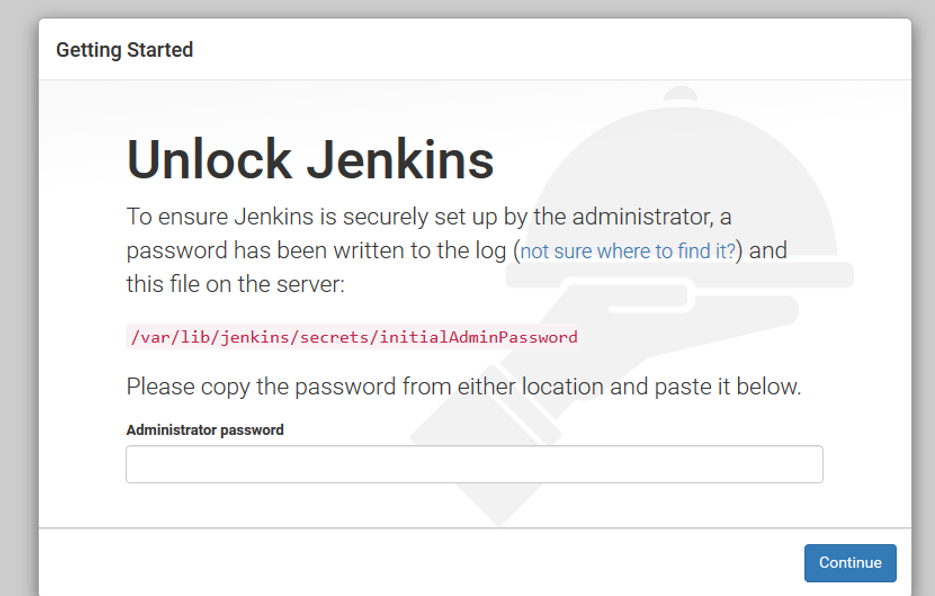

**Installing Jenkins**

>1.Install java packages 
```
sudo yum -y install java-1.8.0-openjdk epel-release
  ```
  
>2.Configure the Jenkins YUM repository
 ```
 sudo wget -O /etc/yum.repos.d/jenkins.repo http://pkg.jenkins-ci.org/redhat-stable/jenkins.repo
 ```
 
  
 
>3.	Install the Jenkins key.
 ```
 sudo rpm --import https://jenkins-ci.org/redhat/jenkins-ci.org.key
 ```
>4.	Install Jenkins.
 ```
 sudo yum -y install jenkins-2.204
 ```
 
  
Note: use the latest version Jenkins to avoid the plugin errors.
 
>5.Enable Jenkins.
 ```
 sudo systemctl enable Jenkins
 ```
 
  

>6. Start Jenkins.
 ```
 sudo systemctl start Jenkins
 ```

   


**Create an account in Jenkins** 
>1.	In browser 
 If you are using cloud to check the Jenkins in browser
   ```
  JENKINS_PUBLIC_IP:8080
   ```
                    
  If you are using physical host 
   ``` 
   localhost:8080
   ```
> 2.	Unlock Jenkins
  
                      

>3.	Find admin password 

 ``` 
 sudo cat /var/lib/jenkins/secrets/initialAdminPassword
 ```

   
    
    
Then select the Install suggested plugins


   
  
  
To avoid the error use latest version Jenkins 


  
 


